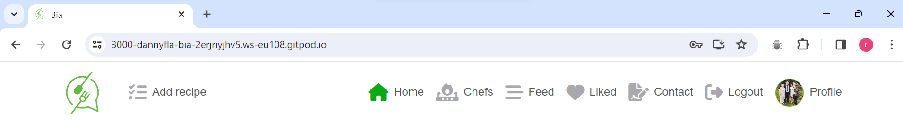
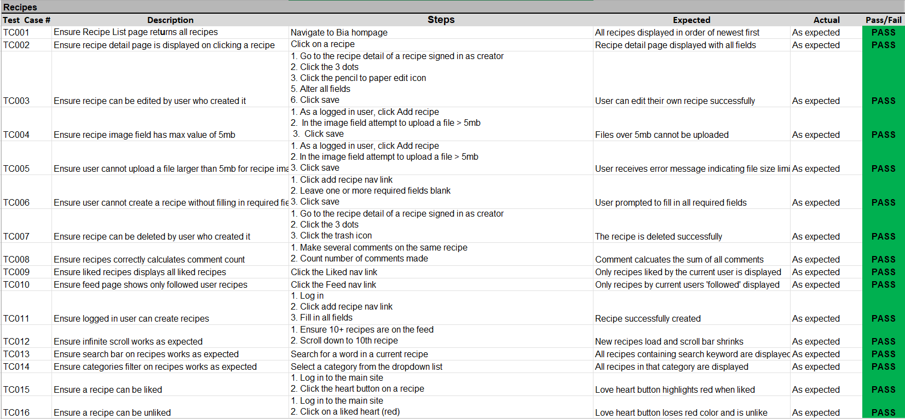
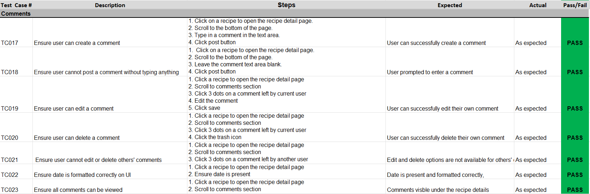

# Bia

Bia is a social media platform for cooking enthusiasts and food lovers. Users are able to share their recipes, become registered Chefs while also being albe to follow other users and like/ comment on their uploads.

Click here to view the site [Live Link](https://bia-code-institute-00aa55848eed.herokuapp.com/)

## Strategy Plane

### Site Aims

Bia's goal is to create a platform for like-minded users that love food and want to share their thoughts and experiences. Users can showcase their work, offer their opinion and engage with others in an interactive community.

### Agile Planning

This project was developed utilizing agile methodologies, delivering small features in incremental sprints over three weeks, with a total of three sprints evenly spaced out.

Each feature was categorized into epics and prioritized under labels such as "Must have," "Should have," and "Could have." The implementation followed a sequence where "Must have" features were completed first, followed by "Should haves," and finally, "Could haves." This approach ensured that core requirements were addressed initially, with additional features incorporated based on available capacity.

The Kanban board was established using GitHub Projects, providing a visual representation of the project's progress. It can be accessed here for further details on individual project cards. All stories, excluding documentation tasks, were accompanied by comprehensive acceptance criteria to define the functionality required for their completion.

### Epics

#### Set Up

This Epic encompasses the initial setup of the React application and its dependencies to facilitate the commencement of feature coding.

#### Recipes

This Epic focuses on the frontend development of the application concerning recipes. It aims to enable users to interact with the backend API through the user interface for creating, reading, updating, and deleting their recipes.

#### Comments

This Epic concentrates on the frontend development of the application concerning comments on recipes. Its objective is to enable users to interact with the backend API to add comments on recipes.

#### Profiles

This Epic concentrates on the frontend development of the application concerning user profiles. Its aim is to enable users to interact with the backend API through the user interface to manage their profiles.

#### Chefs

This Epic centers on the frontend development of the application concerning chefs. It aims to enable users to interact with the backend API to register/unregister themselves as chefs and display their chef information.

#### Reviews

This Epic focuses on the frontend development of the application concerning chef reviews. Its goal is to enable users to interact with the backend API through the user interface to leave reviews on specific chef.

#### Contact

This epic covers the front end creation of the application in regards to site contact form. Its purpose is to interact with the backend API through the user interface for allowing users to send queries to the admin.

## User Stories

**Recipes**

- As a logged in user I can create recipes so that I can share my ideas
- As a user I can keep scrolling through the images on the site, that are loaded for me automatically so that I don't have to click on "next page"
- As a recipe owner I can edit my recipe title and description so that I can make corrections or update my recipe after it was created
- As a logged in user I can view content filtered by users I follow so that I can keep up to date with what they are posting about
- As a logged in user I can view the recipes I liked so that I can find the recipes I enjoy the most
- As a user I can view all the most recent recipes, ordered by most recently created first so that I am up to date with the newest content
- As a logged in user I can like a recipe so that I can show my support for the recipes that interest me
- As a user, I can search for recipes with keywords, so that I can find the recipes and user profiles I am most interested in.
- As a user I can view the details of a single recipe so that I can learn more about it

**Comments**

- As a logged in user I can add comments to a recipe so that I can share my thoughts about the recipe
- As a user I can see how long ago a comment was made so that I know how old a comment is
- As a user I can read comments on recipes so that I can read what other users think about the recipes
- As an owner of a comment I can delete my comment so that I can control removal of my comment from the application
- As an owner of a comment I can edit my comment so that I can fix or update my existing comment

**Profiles**

- As a user I can view all the recipes by a specific user so that I can catch up on their latest recipes, or decide I want to follow them
- As a user I can view other users profiles so that I can see their recipes and learn more about them
- As a user I can create a new account so that I can access all the features for signed up users
- As a user I can view user's avatars so that I can easily identify users of the application
- As a user I can tell if I am logged in or not so that I can log in if I need to
- As a user I can see a list of the most followed profiles so that I can see which profiles are popular
- As a user I can view statistics about a specific user: bio, number of recipes, follows and users followed so that I can learn more about them
- As a logged in user I can follow and unfollow other users so that I can see and remove recipes by specific users in my recipes feed
- As a logged in user I can edit my profile so that I can change my profile picture and bio
- As a logged in user I can update my username and password so that I can change my display name and keep my profile secure

**Setup**

- As a user, I would like a favicon on the website so that I can easily know which tab belongs to Bia
- As a logged out user I can see sign in and sign up options so that I can sign in / sign up
- As a user, I would like a fully responsive navigation menu so that I can easily access the site from any device

**Chefs** 

- As an chef, I would like to be able to register my details so others can view my work and contact details
- As a user, I would like to be able to rate an chef so that owthers can see my rating and review

**Contact**

- As a user, I would like to be able to contact the site owner in case I have any issues or queries.

## The Structure Plane

## Features:

**Setup**

*User Story:*

`As a user, I would like a favicon on the website so that I can easily know which tab belongs to Bia`

*Implementation:*

A site favicon, featuring the site's logo, has been incorporated. This enhancement enables users to readily recognize Bia when navigating multiple open tabs.

*User Story:*

`As a logged out user I can see sign in and sign up options so that I can sign in / sign up`

*Implementation:*

Implemented checks to detect user authentication status (signed in or signed out) and adjust navigation items accordingly. This functionality prevents users from accessing restricted pages by clicking buttons in the UI.

Additionally, URL redirects were implemented to restrict access to pages intended for logged-in users, ensuring unauthorized access is prevented when users are logged out.

*User Story:*

`As a user, I would like a fully responsive navigation menu so that I can easily access the site from any device`

*Implementation:*

A navigation menu was implemented than collapses into a hamburger menu on smaller devices. This will ensure that no navigation items overlap and users can access and navigate the site from any size device.

**Navigation Menu**

*User Stories:*

`As a logged out user I can see sign in and sign up options so that I can sign in / sign up`
`As a user, I would like a fully responsive navigation menu so that I can easily access the site from any device`

*Implementation:*

A fully responsive navigation menu has been integrated throughout the website, enabling users to navigate effortlessly to various pages regardless of the device they are using. Navigation items dynamically adjust based on the user's logged-in status to restrict access to areas of the application intended exclusively for signed-in users.

*Logged in users:*

When a user is logged in the following navigation items are shown:

- Add Recipe
- Home
- Chefs
- Feed
- Liked
- Contact Us
- Sign Out
- Users Profile picture and Username

*Logged out users:*

- Home
- Contact Us
- Sign In
- Sign Up

The navigation icons transition to a green hue when the respective page is active. This feature serves to visually indicate to users their current location within the website.

**Home** 

*User Story:*

`As a user I can view all the most recent recipes, ordered by most recently created first so that I am up to date with the newest content`

*Implementation:*

The homepage showcases user recipes with the newest ones appearing at the top, and these recipes are visible to all visitors regardless of whether they are logged in. This enables non-registered users to explore the site's content and decide whether they want to sign up. However, access to features such as creating recipes, liking, and commenting is restricted for users who are not logged in.
 
**Recipes** 

*User Story:*

`As a user I can keep scrolling through the images on the site, that are loaded for me automatically so that I don't have to click on "next page"`

*Implementation:*

To optimize the viewing experience infinite scrolling was introduced, which loads 10 recipes sequentially. As users reach the bottom of the page, an additional set of 10 recipes is automatically loaded, ensuring smooth and efficient browsing with minimal loading times.

*User Story:*

`As a user I can view all the most recent recipes, ordered by most recently created first so that I am up to date with the newest content `

*Implementation:*

The recipes, feed, and liked pages are organized with the newest content displayed first. This arrangement ensures that users won't encounter previously viewed content at the top, reducing the necessity for them to actively search for new recipes.

*User Story:*

`As a user I can view the details of a single recipe so that I can learn more about it`

*Implementation:*

A recipe detail page has been added that is visible to all users, this will allow them to see the full recipe detail and comments.

*User Stories:*

`As a logged in user I can like a recipe so that I can show my support for the recipes that interest me`

*Implementation:*

Registered users have complete access to adding recipes, commenting, liking, and unliking content. This measure helps prevent spamming by unregistered users while also encouraging genuine users to register on the site.

*User Story:*

`As a recipe owner I can edit my recipe title and description so that I can make corrections or update my recipe after it was created`

*Implementation:*

Only the creator of a recipes will have the ability to edit or delete it. This feature ensures that users maintain complete control over their own recipes and prevents unauthorized users from altering them.

*User Story:*

`As a logged in user I can create recipes so that I can share my ideas`

*Implementation:*

A "add Recipe" button has been placed in the nav bar in order for logged in users to create a recipe when they want to share something.

*User Story:*

`As a logged in user I can view content filtered by users I follow so that I can keep up to date with what they are posting about`

*Implementation:*

Users can navigate to the Feed section, where only recipes from users they follow will be displayed.

*User Story:*

`As a logged in user I can view the recipes I liked so that I can find the recipes I enjoy the most`

*Implementation*

Authenticated users can navigate to their "liked" section to view all the recipes they have liked.

*User Story:*

`As a user, I can search for recipes with keywords, so that I can find the recipes and user profiles I am most interested in.`

*Implementation:*

An added search bar enables users to search for specific keywords, facilitating the exploration of content tailored to their interests.

**Comments**

Each recipe will feature a comment box accessible to logged-in users, enabling them to contribute comments. 

Additionally, a comment count will be visible beneath the recipe, indicating the number of comments received.

The time of the last comment or update will be displayed in either minutes or days ago. Each comment will showcase the username and avatar of the user who posted it.

**Profiles**

*User Story:*

`As a user I can view other users profiles so that I can see their recipes and learn more about them`

*Implementation:*

Profile pages are now available and can be accessed by clicking on a user's avatar displayed on a recipe. Additionally, users can view their own profile by clicking on their icon from the navigation menu.

*User Story:*

`As a logged in user I can edit my profile so that I can change my profile picture and bio`

*Implementation:*

When users own the profile, they can edit it using the profile form accessed through the three-dot dropdown menu on the profile page.

*User Story:*

`As a logged in user I can update my username and password so that I can change my display name and keep my profile secure`

*Implementation:*

Users can also edit their username or password by clicking on the corresponding options in the dropdown menu and completing the required forms.

*User Story:*

`As a user I can tell if I am logged in or not so that I can log in if I need to`

*Implementation:*

When a user is logged in, their profile image is visible in the top right corner of the navigation bar. This feature makes it easy for users to identify when they are logged in and which account they are currently using, especially if they have multiple accounts.

**Most followed profiles**

*User Stories:*

`As a user I can view all the recipes by a specific user so that I can catch up on their latest recipes, or decide I want to follow them`

`As a user I can see a list of the most followed profiles so that I can see which profiles are popular`

`As a user I can view statistics about a specific user: bio, number of recipes, follows and users followed so that I can learn more about them`

`As a logged in user I can follow and unfollow other users so that I can see and remove recipes by specific users in my recipes feed`

*Implementation:*

A component showing the most followed users is shown and the user profiles are able to be viewed by clicking on these. On a desktop, the most followed users has 10 users. On a mobile device this is restricted to 4 so that it does not take up too much room as scrolling may become a nuisance. A follow button will also be displayed that will allow the logged in user to follow the target user.

**Chefs**

*User Story:*

`As an chef, I would like to be able to register my details so others can view my work and contact details`

*Implementation::*

Users have the option to register as chefs if they wish to showcase their information, including specialty, location, hourly rate, and contact details, to other users. Users can choose to follow registered chefs to stay updated on their work.

To register as a chef, users can access their profile page and click on the three-dot icon to reveal a dropdown menu. From there, they can select "Register as Chef," which will redirect them to a form to fill in their details.

**Chef Reviews**

*User Story:*

`As a user, I would like to be able to rate an chef so that owthers can see my rating and review`

*Implementation:*

If users are not the owners of a profile, they will find a "Leave a Review" button available, allowing them to leave feedback on that particular chef.

Users can provide textual reviews and rate chefs out of 5 by completing the review form accessible through the "Leave Review" option on the chef's profile.

A star rating component has been incorporated, enabling users to easily select the desired number of stars for their rating. The selected stars will illuminate to visually represent the user's rating.

The average rating of the chef is prominently displayed on their profile as a calculated average, derived from the total sum of all ratings divided by the number of ratings submitted

**Contact**

*User Story:*

`As a user, I would like to be able to contact the site owner in case I have any issues or queries.`

*Implementation:

A contact form has been included in the navigation menu, enabling users to submit requests for assistance or inquiries.

### Future Features

A feature will be implemented that will allow users to option to upload a video of the composition of the recipe and instructions

A feature will be implemented that will allow users the ability to send priviate messages directly to one another.

## The Skeleton Plane

#### Wireframes

**Home**

**Sign In/Up**

**Feed**

**Likd**

**Profiles**

**Chef Page**

**Chef Create**

**Recipe Create**

**Contact**

## The Surface Plane

### Design

**Colour-Scheme**

The app's background color sets a soft tone with a light shade of #f8f8f8, creating a clean and inviting atmosphere. Each component within the app features a crisp white background (#ffffff), ensuring clarity and highlighting content effectively.

To add a pop of color and enhance user engagement, key elements like logos, active icons, and header texts are highlighted in a lively green tone (#03ac13). This color choice helps draw attention to important areas and prompts interaction.

For easy readability, the main text is presented in a darker shade of #243b24, maintaining a good contrast with the background while remaining pleasant to the eye.

Buttons stand out with their vibrant colors: sign up and sign in buttons use a bright green (#3ded97) to encourage action, while other buttons retain the app's signature green hue (#03ac13), ensuring consistency across the interface.

Overall, this color palette creates a visually appealing and user-friendly environment, making navigation intuitive and interactions seamless.

#### Typography

A carefully selected typeface, "Roboto," serves as the cornerstone of the website's typography, providing a modern and versatile aesthetic.

#### Imagery

The imagery featured on this website is a blend, comprising both user-uploaded content and legally sourced images obtained from reputable stock image websites such as [unSplash](https://unsplash.com/) and [Pexels](https://www.pexels.com/).

## Technologies

- React
    - Main framework used to create the user interface
- Node
    - Package manager used to install dependencies
- Eslint
    - Linting tool used in order to check best practice coding standards
- Diffchecker
    - Used for file comparisons
- Heroku
    - Used for application hosting
- Git
    - Version control software
- Github
    - Repository used to store base code and docs

## Testing

#### Recipes 

#### Comments 

#### Chefs 

#### Contact 

#### Profiles 

#### Authorization 

## Deployment

### Heroku Deployment

The deployment process to Heroku involves the following steps:

1. Go to the Heroku website and sign up for an account.
2. Click on the "New" button located in the top right corner.
3. Choose "Create New App" from the dropdown menu.
4. Enter the desired app name and select the region, then click "Create App."
5. Navigate to the "Resources" tab and search for "Heroku Postgres."
6. Choose the "Hobby Dev" option and proceed.
7. Move to the "Deploy" tab.
8. Scroll down to "Connect to GitHub" and follow the prompts to sign in or authorize.
9. Search for the repository you wish to deploy and click "Connect."
10. Scroll further down to "Manual Deploy" and select the main branch.
11. Finally, click "Deploy" to initiate the deployment process.

[Deployed Link](https://bia-code-institute-00aa55848eed.herokuapp.com/)

## Version Control

The website was developed using the Visual Studio Code editor and then pushed to the remote repository named 'bia' on GitHub.

During development, the following Git commands were utilized to manage code changes:

`git add <file>` This command was employed to add specific file(s) to the staging area before committing them.
`git commit -m "commit message"` Used to commit changes to the local repository, queuing them up for the final step.
`git push `This command facilitated the pushing of all committed code to the remote repository hosted on GitHub.

### Run Locally

To run the project locally, follow these steps:

1. Go to the GitHub Repository you wish to clone for local use.
2. Click on the "Code" dropdown button.
3. Select "HTTPS" and copy the repository link.
4. Open your preferred Integrated Development Environment (IDE) (ensure Git is installed).
5. In the IDE terminal, type git clone <copied-git-url> and press Enter.
6. The project will be cloned onto your local machine for use.

Install Dependencies:

`npm install`

Run Application:

`nvm install 16`

`nvm use 16`

`npm start`

### Forking

Typically, forks serve two main purposes: proposing changes to another project or using an existing project as a foundation for your own.

To fork a GitHub Repository:

1. Navigate to the repository you wish to fork.
2. Locate the fork button on the top right of the page, under the header, and click it.
3. This action will duplicate the entire project in your GitHub Repository.

## Credits

- The Logo for the site was created using [LogoMakr](https://logomakr.com/)
- Various images that are used throughout the site were sourced ethically from Stock Image websites such as [unSplash](https://unsplash.com/) and [Pexels](https://www.pexels.com/)
- I referred to the [documentation](https://www.npmjs.com/package/react-simple-star-rating) for the Star Rating System to assist with installing and utilizing the external component.
- Code to handle current user context in `src/contexts/CurrentUserContext.js` was adapted from Code Institute 'Moments' React walkthrough lessons
- Code to create and use axios interceptors to refresh tokens in `src/contexts/CurrentUserContext.js` and `src/utils/utils.js`was adapted from the Code Institute 'Moments' React walkthrough lessons
- This [article](https://www.npmjs.com/package/react-rte?activeTab=readme) was followed in order to utilize Rich Text Editor.

## Acknowledgements

This fictional site was created during my Full-Stack Software Development course with Code Institute. This site is is Portfolio Project #5 (Advanced Front-End). I would like to express my gratitude to my mentor Gareth McGirr for his guidance and support throughout the creation of this project. His feedback has been invaluable. I would also like to thank Code Institute's tutor support for their feedback and assistance.
